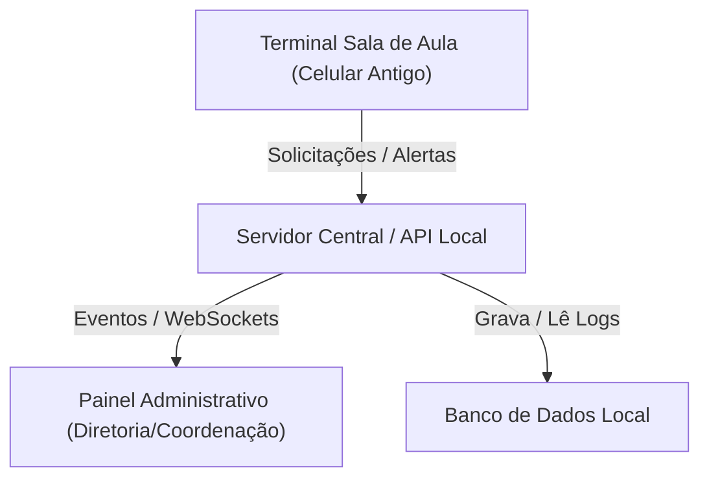

# Relatório de Arquitetura e Modelagem - EcoTerminal Escolar

## 1. Visão Geral da Arquitetura
O **EcoTerminal Escolar** é composto por terminais locais em Modo Kiosk (celulares antigos executando uma interface leve) que se comunicam via rede Wi-Fi local (HTTP/WebSockets) com um Servidor Central. O painel administrativo da escola acessa o servidor para visualizar os alertas em tempo real, enquanto os logs e históricos de chamados são mantidos no banco de dados.



flowchart TD
    N1["Inicio: Ligar Terminal"] --> N2["Inicializar Modo Kiosk no App"]
    N2 --> N3["Exibir Tela Principal da Sala"]
    N3 --> N4{"Escolha do Alerta / Chamado"}
    
    N4 -->|Chamar Professor| N5["Selecionar Troca de Aula"]
    N4 -->|Suporte / Emergência| N6["Selecionar Limpeza, TI ou Saúde"]
    N4 -->|Comunicação Diretoria| N7["Verificar Notificações Recebidas"]
    
    N5 --> N8["Enviar Evento ao Servidor Local"]
    N6 --> N8
    N7 --> N8
    
    N8 --> N9["Notificar Painel Administrativo em Tempo Real"]
    N9 --> N3
```
