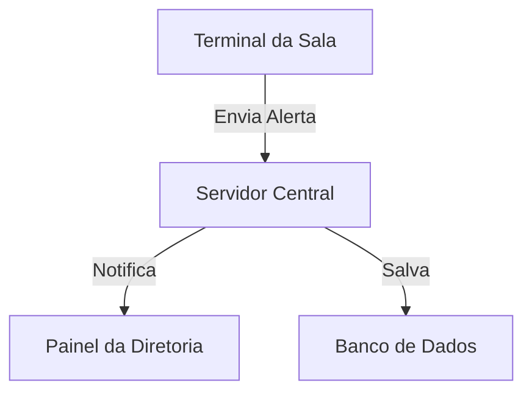
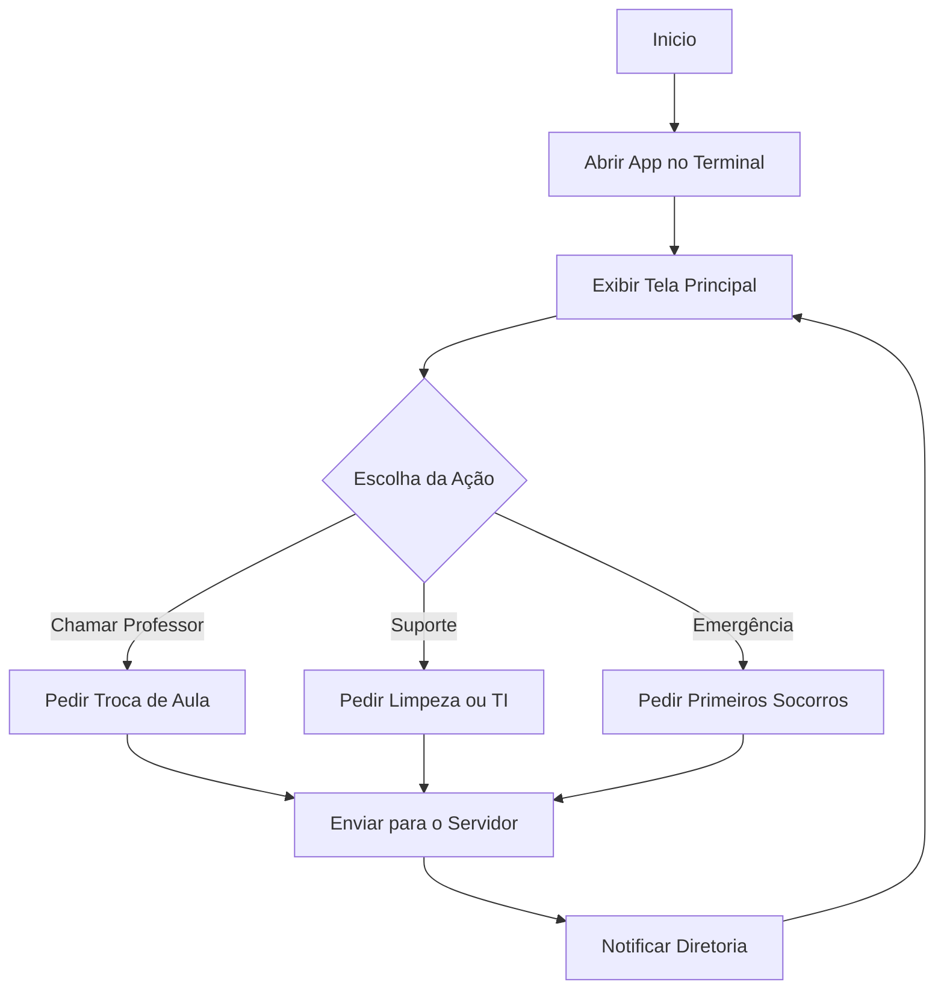

# Relatório de Arquitetura e Modelagem - EcoTerminal Escolar

## 1. Visão Geral da Arquitetura
O **EcoTerminal Escolar** utiliza celulares antigos nas salas de aula rodando em Modo Kiosk (aplicativo dedicado). Eles se conectam via Wi-Fi ao servidor da escola, que envia as notificações para a diretoria e coordenação.


---
##2 2. Diagrama de Fluxo do Usuário

---
## 3. Estrutura de Dados
```json
[
  {
    "id": 101,
    "sala": "1º Ano A",
    "tipo": "Suporte TI",
    "descricao": "Projetor desligado",
    "status": "Pendente"
  }
]
```
---

## 4. Protótipo da Interface e Componentes (Wireframe)
A interface do terminal foi projetada para ser simples, responsiva e com botões grandes para telas de celulares:

1. **Cabeçalho (Header)**: Identificação da sala (ex: *1º Ano A*), sinal de Wi-Fi e relógio.
2. **Painel Principal**: Botões de toque rápido (**Chamar Professor**, **Limpeza**, **Suporte TI** e **Emergência**).
3. **Rodapé**: Espaço para avisos e comunicados enviados pela diretoria.
